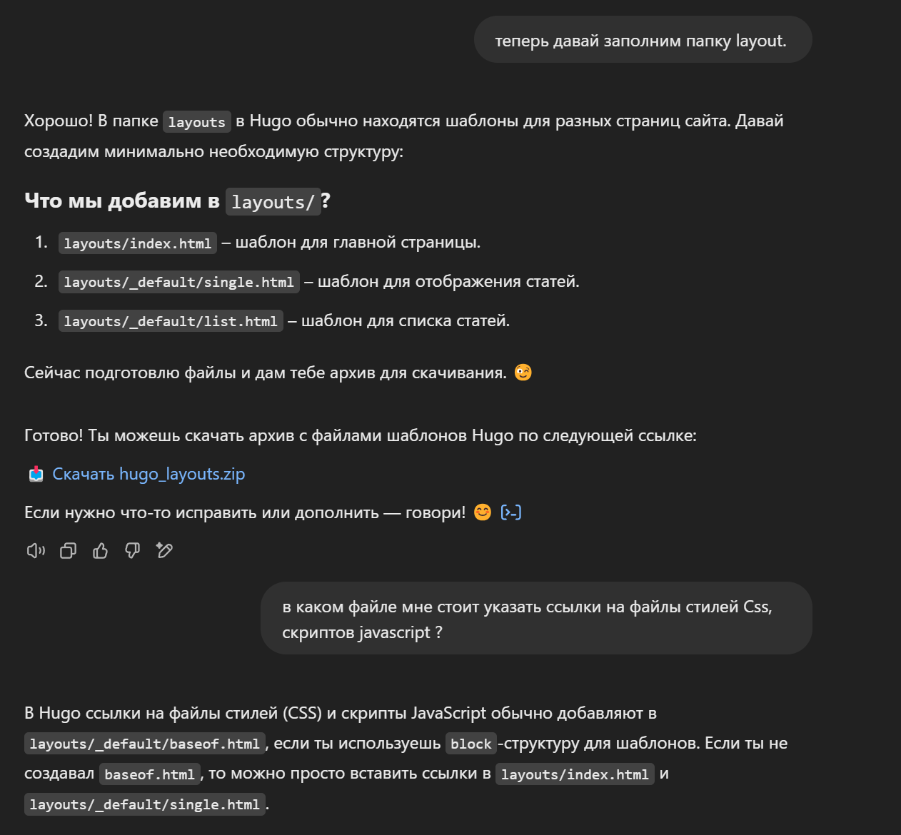
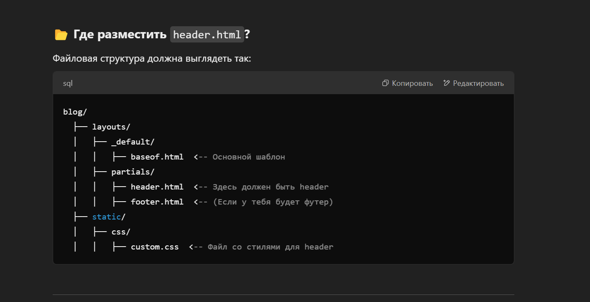

Я решил создать персональный блог, где буду публиковать материалы о программировании, настройке сервисов, контейнерах и других технических темах. Как обычно, первым делом нужно было выбрать подходящий инструмент для создания сайта.

В поисках готовых решений я наткнулся на фреймворк **Hugo**. Он написан на Go, обладает высокой скоростью работы и предлагает множество готовых тем. Мне показалось, что это отличный вариант для блога, и я решил глубже изучить его возможности.

### Что такое Hugo?

**Hugo** — это статический генератор сайтов, который преобразует Markdown-файлы в HTML. Он быстрый, удобный и отлично подходит для создания блога. Однако я решил **не использовать готовые темы**, а создать свою собственную с нуля, чтобы лучше понять, как работает этот фреймворк.

### Использование ChatGPT как ассистента

Для помощи в написании кода я решил воспользоваться **ChatGPT**. Честно говоря, я был приятно удивлен его возможностями.

Я начал с того, что описал ассистенту свои цели: создать блог на Hugo с собственной темой. Первые рекомендации были довольно простыми — ассистент подготовил всего два файла: для главной страницы и отдельной статьи. Конечно, этого было недостаточно, поэтому я уточнял детали и получал все более сложные конфигурации. В какой-то момент он даже **создал архив файлов и предложил мне его скачать**:

Вот еще один пример взаимодействия с ассистентом:

### Итоги работы с ChatGPT

Работа ассистента мне понравилась. В этом небольшом проекте он помог мне быстро разобраться с Hugo, настроить его и создать свою тему. Также он помог мне написать стили и создать логотип. Конечно, не все было идеально — например, я долго дорабатывал логотип, так как сгенерированное изображение не совсем соответствовало моим ожиданиям. Однако, в итоге я взял за основу предложенный вариант и доработал его.

Для себя я решил, что ChatGPT будет полезным инструментом и дальше, особенно в работе над новыми проектами. Его можно использовать как ассистента для написания кода, поиска решений и генерации идей. Этот опыт показал, что с его помощью можно ускорить процесс разработки и сделать его более удобным.
